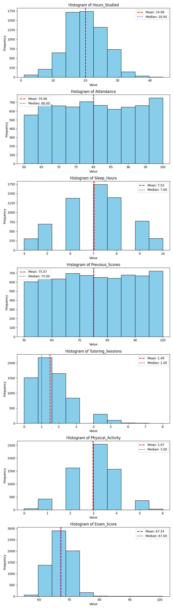

# Summary Report

## Dataset Overview

This dataset provides a comprehensive overview of various factors affecting student performance in exams.

### First 5 Rows of the Dataset

|    |   Hours_Studied |   Attendance |   Sleep_Hours |   Previous_Scores |   Tutoring_Sessions |   Physical_Activity |   Exam_Score |
|---:|----------------:|-------------:|--------------:|------------------:|--------------------:|--------------------:|-------------:|
|  0 |              23 |           84 |             7 |                73 |                   0 |                   3 |           67 |
|  1 |              19 |           64 |             8 |                59 |                   2 |                   4 |           61 |
|  2 |              24 |           98 |             7 |                91 |                   2 |                   4 |           74 |
|  3 |              29 |           89 |             8 |                98 |                   1 |                   4 |           71 |
|  4 |              19 |           92 |             6 |                65 |                   3 |                   4 |           70 |

## Summary Statistics

|    | statistic   |   Hours_Studied |   Attendance |   Sleep_Hours |   Previous_Scores |   Tutoring_Sessions |   Physical_Activity |   Exam_Score |
|---:|:------------|----------------:|-------------:|--------------:|------------------:|--------------------:|--------------------:|-------------:|
|  0 | count       |      6607       |    6607      |    6607       |         6607      |          6607       |          6607       |   6607       |
|  1 | null_count  |         0       |       0      |       0       |            0      |             0       |             0       |      0       |
|  2 | mean        |        19.9753  |      79.9774 |       7.02906 |           75.0705 |             1.49372 |             2.96761 |     67.2357  |
|  3 | std         |         5.99059 |      11.5475 |       1.46812 |           14.3998 |             1.23057 |             1.03123 |      3.89046 |
|  4 | min         |         1       |      60      |       4       |           50      |             0       |             0       |     55       |
|  5 | 25%         |        16       |      70      |       6       |           63      |             1       |             2       |     65       |
|  6 | 50%         |        20       |      80      |       7       |           75      |             1       |             3       |     67       |
|  7 | 75%         |        24       |      90      |       8       |           88      |             2       |             4       |     69       |
|  8 | max         |        44       |     100      |      10       |          100      |             8       |             6       |    101       |

## Data Visualization

